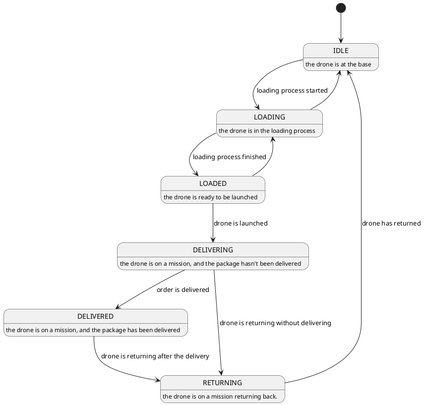
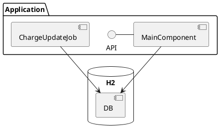
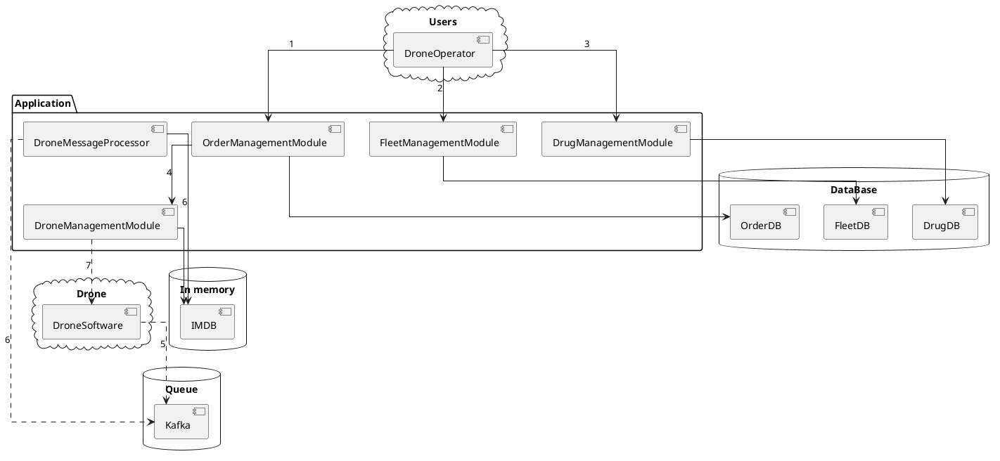
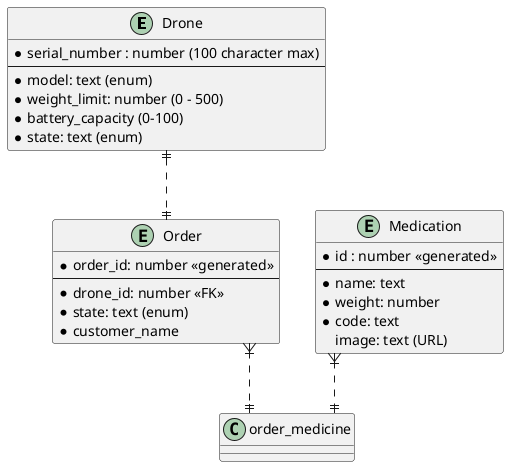

# Task for the position of Java Software Engineer (Summer 2023)
---------------------
# Requirements

## Functional

**Initial**

| REQ |                                     Requirement                                     |                                      Notes                                      |
|:---:|:-----------------------------------------------------------------------------------:|:-------------------------------------------------------------------------------:|
|  1  |                              I can registering a drone                              | We have a fleet of 10 drones but we can add more drones, starting status - IDLE |
|  2  |                      I can load a drone with medication items                       |       Status LOADING in the beginning, LOADED at the end of the operation       |
|  3  |                I can check loaded medication items for a given drone                |                                        -                                        |
|  4  |                     I can checking available drones for loading                     |                               In the IDLE status                                |
|  5  |                  I can check drone battery level for a given drone                  |                              Identifications by id                              |
|  6  |       Prevent the drone from being loaded with more weight that it can carry        |                         Validation for the UC **REQ2**                          |
|  7  | Prevent the drone from being in LOADING state if the battery level is **below 25%** |                         Validation for the UC **REQ2**                          |

**Missed requirements/assumptions**

|  #  |                                             Requirement                                              |                                                    Notes                                                     |
|:---:|:----------------------------------------------------------------------------------------------------:|:------------------------------------------------------------------------------------------------------------:|
|  8  |                              I need to launch a drone when it's loaded                               |                                    The drone status: LOADED -> DELIVERING                                    |
|  9  |                             I need to be able to receive the drone back                              |                        The drone status: DELIVERING -> IDLE (later RETURNING -> IDLE)                        |
| 10  |        During a flight the drone's status should be changed depending on the delivery status         |               Look at the status table below, *assumption* - out of the current project scope                |
| 11  |                    A drone's battery level should decreased while it in delivery                     |                   Scheduled task for drones on mission - DELIVERING, DELIVERED, RETURNING                    |
| 12  | A drone's should control its charge and stop the mission at the minimum charge needed to return back |                               *Assumption* - out of the current project scope                                |
| 13  |                         We need to audit changes in the drone's change level                         |             For now - just console output: *"Current change level of drone {id} is {percent}%%"*             |
| 14  |                     We need to keep track of what medicines have been delivered                      | We introduce the new entity *ORDER* which matches medicines and drones, *restrictions* - one drone per order |

### Status model




## Non-functional*

- [*] Input/output data must be in JSON format;
- [*] Your project must be buildable and runnable;
- [*] Your project must have a README file with build/run/test instructions (use DB that can be run locally, e.g. in-memory, via container);
- [*] Any data required by the application to run (e.g. reference tables, dummy data) must be preloaded in the database;
- [*] Unit tests;
- [*] Use a framework of your choice, but popular, up-to-date, and long-term support versions are recommended.

## Backlog
- add dto level and its own validation
- add the number to the medicines in the order
- integration test
- delete medication | order

- replace real deletion with changing status
- add schema initialization script or migration tool (liquibase | flyway)

## Out of scope

1) At this stage, we don't consider interaction with drone while they are on mission so the drone status is managed manually (it's a black box from the moment we launch the drone to the moment it returns).

# Architecture

**Technology**
- Java 17
- Spring boot 3.1.2
- Local H2 DB

**Prerequisites**
- We don't have any requirements for performance and data durability so for the MVP purpose we are going to use embedded H2 DB.
- We don't implement real communication with drones so for now we just run a job to update a charge level of drones. 
    
**Current architecture**



**Target architecture (draft)**




1) We are going to separate interfaces for users (operators) and drones.
2) The DB is responsible for order and fleet management whereas the IMDB is responsible for data from drones (charge level, GPS coordinates, etc).
3) Modules: 
  - DroneManagementModule - manage communication with drones (calculate when to return, send commands) -> probably later will be split into several modules (commands, video processing, navigation, etc)
  - DroneMessageProcessor - process heartbeat messages from drones (state: charge level, GPS coordinates, etc)
  - OrderManagementModule - manage orders (load and launch drones)
  - FleetManagementModule - manage the drone fleet (add, remove, replace, change metadata, get idle etc)
  - DrugManagementModule - manage medicines
4) API and operations
   - (1) sync order management
   - (2) sync fleet management 
   - (3) sync drug management
   - (4) notification on the drone launch
   - (5) drones heartbeats
   - (6) async processing heartbeat messages from drones (update IMDB)
   - (7) commands to drones

# DB




# API

Open API documentation are available at: ```localhost:{{port}}/swagger-ui/index.html``` 

# Build & Run

1) After the first application run, it need to set ```spring.jpa.hibernate.ddl-auto=valuate``` in ```application.yml```. 
2) Run ```mvn package```
3) Run ```java -jar .\DEV_DRONES-373200e7-c296-004f-96a9-410418c98c47\target\DroneManager-0.0.2-SNAPSHOT.jar```.                  


